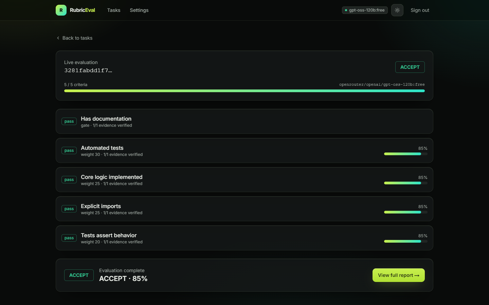
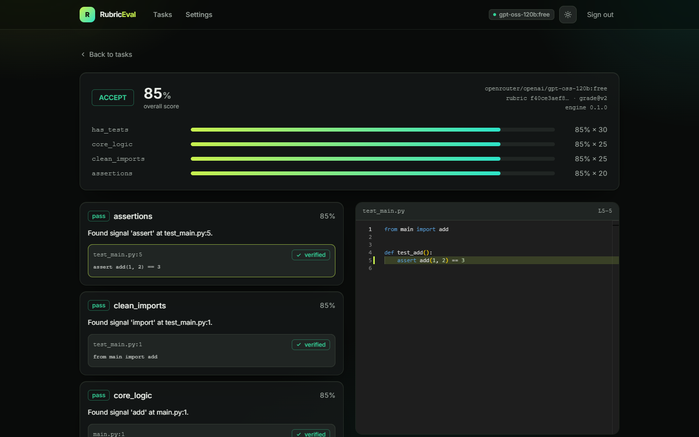
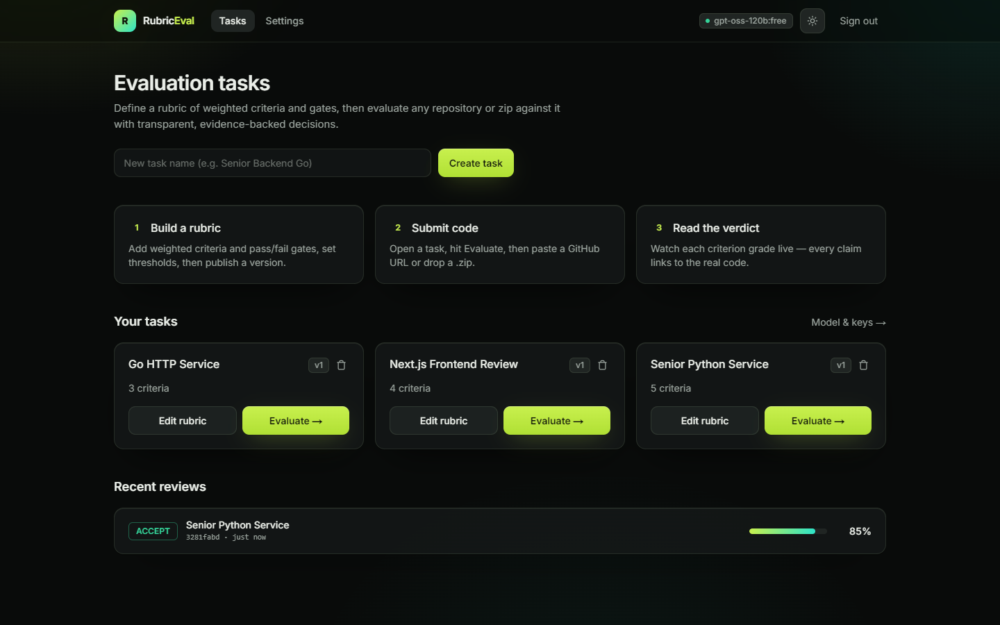
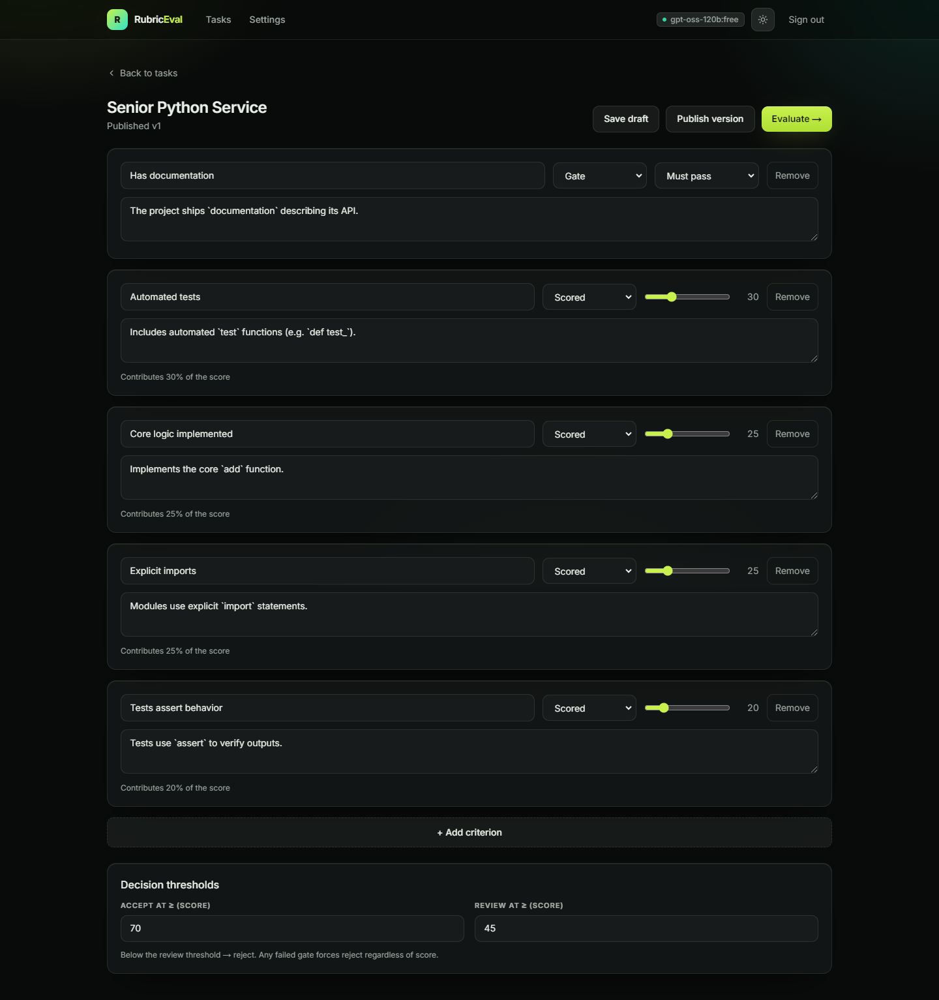
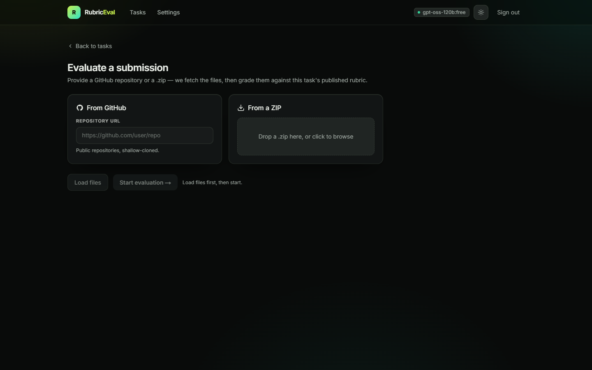
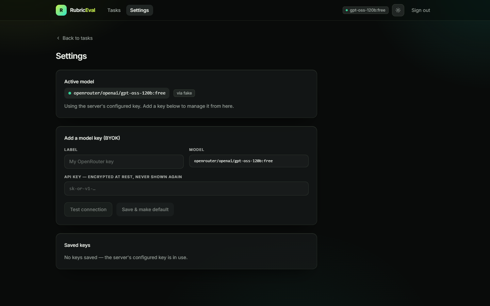
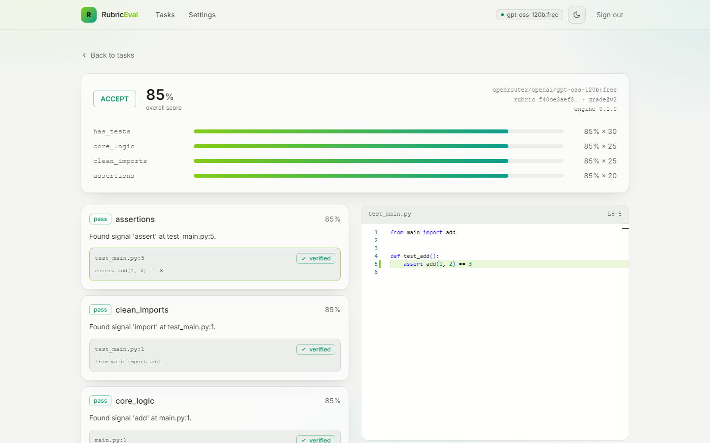
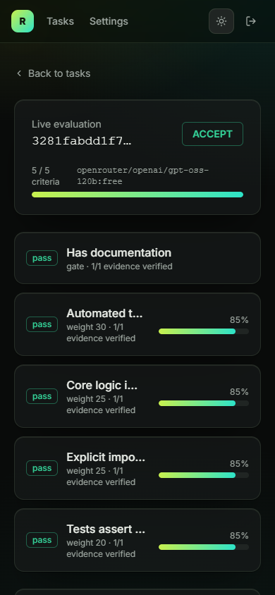
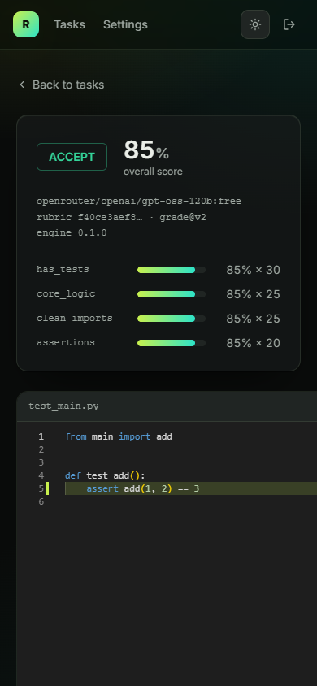

# RubricEval — rubric-driven evaluation platform

[](https://github.com/Sina-Amare/RubricEval/actions/workflows/ci.yml)
[](LICENSE)


Define a **rubric** of weighted criteria and gates, submit a GitHub repo or a
ZIP, watch a **live** per-criterion evaluation, and get an **accept / review /
reject** decision backed by **verified evidence** mapped to the real code.

The LLM grades each criterion independently with citations; a **deterministic
policy** in code makes the final decision (the model never decides). Every
review stores the rubric version, model id, and prompt version, so results are
reproducible.

<p align="center">
  
</p>

---

## Why it's built this way

The three things most "AI reviewers" tangle together are kept separate:

| Concern | Where it lives |
|---|---|
| **What** to evaluate | A versioned, content-hashed **rubric** (data, not code) |
| **How** to judge | The LLM grades one criterion at a time → `{verdict, score, confidence, evidence[]}` |
| **Decide** | A pure, unit-tested **policy** function (weights + gates + thresholds) |

So adding a task is data, not code, and one prompt tweak can never silently
flip every result. Evidence citations are **verified against the real files**
(path + line + quote); unverifiable citations are flagged, never trusted.

## Screenshots

**Final report** — every verdict carries evidence, and each citation jumps to
the exact lines in **Monaco**, verified against the real file.



| Dashboard — tasks &amp; recent verdicts | Task builder — weighted criteria &amp; gates, as data |
|:--:|:--:|
|  |  |
| **Submit** — a GitHub repo or a ZIP | **Settings** — BYOK provider + live connection test |
|  |  |

<sub>Light &amp; dark themes, responsive down to mobile:</sub>

<p>
  
  &nbsp;
  
  &nbsp;
  
</p>

## Architecture

```
backend/  FastAPI + async SQLAlchemy 2.0 (Postgres or SQLite) + Alembic
  app/core        domain enums + exceptions
  app/db          ORM models, repositories, async engine
  app/ingestion   GitHub (off-thread clone) + ZIP (zip-slip/zip-bomb safe) -> NormalizedFileSet
  app/engine      relevance file selection · grader · evidence verifier · deterministic policy · runner
  app/llm         LiteLLM client (BYOK) + deterministic FakeLLM
  app/jobs        durable leased queue + worker (Postgres SKIP LOCKED / SQLite serialized)
  app/events      append-only event log + in-proc bus -> SSE
  app/eval        golden-set harness + CLI (regression gate)
  app/notify      optional Telegram thin client
frontend/  Next.js (App Router) + TypeScript + Tailwind + Monaco + TanStack Query
```

Reviews run asynchronously on a durable queue; the browser watches progress
over **SSE** (replayable via `Last-Event-ID`), then the report viewer highlights
cited lines in **Monaco**.

> **No API key? Try it offline.** Set `LLM_BACKEND=fake` in `.env` for a fully
> deterministic run — live evaluation, evidence verification, and the report all
> work end-to-end against a built-in fake model, so you can demo the whole flow
> with zero credentials. Optionally seed two ready-made rubrics first with
> `python -m scripts.seed_demo` (from `backend/`, once the API is up).

## Run it — Docker

```bash
cp .env.example .env          # set OPERATOR_TOKEN, APP_SECRET_KEY, OPENROUTER_API_KEY
docker compose up --build
# web → http://localhost:3000   api → http://localhost:8000/api/health
```

Brings up Postgres + API + worker + web. Sign in with your `OPERATOR_TOKEN`.

## Run it — without Docker

Backend (Python 3.11+) and frontend (Node 18+) in two terminals:

```bash
# backend  (SQLite, embedded worker, auto-migrate)
python -m venv backend/.venv
backend/.venv/Scripts/pip install -e "./backend[dev]"      # *nix: backend/.venv/bin/pip
backend/.venv/Scripts/python -m uvicorn app.main:app --app-dir backend --port 8000

# frontend
cd frontend && npm install && npm run dev                  # http://localhost:3000
```

Configure the LLM in `backend/.env` (git-ignored). The provider is inferred
from the model id prefix (`openrouter/…`, `gemini/…`, `groq/…`), so you only
set the keys for the providers you use. Keys may be **comma-separated** to
rotate across them on rate-limits:

```
LLM_BACKEND=litellm
DEFAULT_MODEL=openrouter/openai/gpt-oss-120b:free
FALLBACK_MODEL=gemini/gemini-flash-latest            # tried if the default fails
OPENROUTER_API_KEY=sk-or-v1-...,sk-or-v1-...         # for openrouter/* (2nd key = rotation)
GOOGLE_API_KEY=...                                   # for gemini/* models
GROQ_API_KEY=...                                     # for groq/* models
OPERATOR_TOKEN=change-me
```

The client tries the default model (across its keys), then each `FALLBACK_MODEL`
in turn, so one provider's quota or outage doesn't fail a review. BYOK is also
configurable in-app (keys are Fernet-encrypted at rest, never returned or
logged). Set `LLM_BACKEND=fake` for a fully offline, deterministic run.

**Scales to large repos.** A repository has far more code than fits in one
prompt, so for each criterion the grader sends a compact project-structure
overview plus only the **most relevant files** (scored by structural role +
the criterion's signal terms), bounded by a file-count and char budget. This
keeps every call well under free-tier token limits and means the model grades
real application code — not whatever happens to sort first.

## Test

```bash
cd backend && .venv/Scripts/python -m pytest tests       # unit + integration (mocked LLM)
cd backend && .venv/Scripts/python -m app.eval.cli run --golden golden   # eval harness
cd frontend && npx playwright test                        # browser E2E — needs the API up with LLM_BACKEND=fake
# one-command (Windows): ./scripts/e2e.ps1                 # spins up a FakeLLM API, then runs Playwright
```

- **Unit:** decision policy (exhaustive), evidence verifier, rubric versioning,
  ingestion (zip-slip/caps), JSON recovery, crypto/log-masking, LiteLLM client.
- **Integration (real DB + HTTP):** task/rubric API, submissions (real ZIP
  upload), full engine run, durable jobs, SSE replay, orphan reclaim, BYOK.
- **Real E2E:** `python -m scripts.real_e2e <base_url> <token>` drives a running
  server against the **real** model end-to-end.

## Reliability & security highlights

- Durable, idempotent jobs with boot-time orphan reclaim; per-job temp isolation
  and off-event-loop clones (fixes the classic shared-state/blocking bugs).
- Operator-token auth on every route except `/health`; default-deny.
- Untrusted input: zip-slip + zip-bomb guards, size/file-count caps, no execution.
- Reproducibility: rubric content hash + model id + prompt version stored per review.
```

## License

MIT — see [LICENSE](LICENSE).
